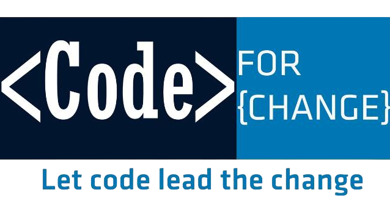

# Code for Change — Official Website (V3)

<p align="center">
  
</p>

<p align="center">
  <a href="https://codeforchangenepal.com"><b>codeforchangenepal.com</b></a>
  <br />
  Empowering IT students across Nepal through community, events, and resources.
</p>

<p align="center">
  
  
  
  
  
  
  
</p>

---

## ✨ Features

| Area | Highlights |
|------|-----------|
| **🎨 Frontend** | React 19 + Vite 7 + Tailwind CSS 4, Framer Motion animations, PWA (installable + push notifications), custom cursor, responsive design |
| **🔐 Auth** | Email/password login, WebAuthn passkeys (biometrics), OTP-based password reset, account lockout, rate limiting |
| **👥 RBAC** | 7 roles (superadmin → guest), 50+ granular permissions, permission override per-user, admin dashboard analytics |
| **📊 Admin** | Full dashboard with counts, trends, charts (Recharts), activity logs, global search, content management for all modules |
| **📝 Content** | Events, Blogs (Creative), Impact stories, Gallery, Resources (role-filtered) |
| **📜 Certificates** | Issue single/bulk, QR code embedded, public verification endpoint, PDF-ready |
| **💳 Donations** | Manual + eSewa payment gateway integration |
| **💼 Careers** | Internships (CRUD) + applications (with resume upload) |
| **📋 Resume Builder** | 3 templates, sections for all resume categories, PDF export, duplicate |
| **🔔 Notifications** | Web Push API, target by role/province, user preference management |
| **📬 Contact & Newsletter** | Rate-limited forms, MX record verification, CSV export |
| **🤝 Community** | Testimonial management, supporter showcase, national team roster |
| **📚 Resources** | Periodicals, walkthroughs (with file management), study materials |
| **🔍 SEO** | Dynamic sitemap.xml + robots.txt generation |

---

## 📖 Documentation

All documentation lives in the [`docs/`](./docs/) directory:

| Document | Description |
|----------|-------------|
| [Architecture](./docs/ARCHITECTURE.md) | System design, data flow, module structure, RBAC, auth flow |
| [API Reference](./docs/API.md) | Complete endpoint documentation for all 22 modules |
| [Setup Guide](./docs/SETUP.md) | Prerequisites, environment variables, local development |
| [Deployment Guide](./docs/DEPLOYMENT.md) | Vercel deployment, production config, checklist |
| [Contributing](./docs/CONTRIBUTING.md) | Git workflow, coding standards, PR process |
| [Edge Cases](./docs/EDGE_CASES.md) | Gotchas, security notes, non-obvious behaviors |

Additional standalone docs:
- [Biometric Login (WebAuthn)](./biometrics-login.md) — Passkey implementation details
- [Code Review & Fixes](./fixing.md) — Security audit findings and proposed fixes

---

## 🚀 Quick Start

```bash
# Backend
cd backend-cfc
cp .env.example .env    # edit with your credentials
npm install
npm run dev             # → http://localhost:5000

# Frontend (new terminal)
cd frontend-cfc
cp .env.example .env    # edit VITE_API_BASE_URL if needed
npm install
npm run dev             # → http://localhost:5173
```

See the full [Setup Guide](./docs/SETUP.md) for detailed instructions, environment variable reference, and troubleshooting.

---

## 🏗️ Tech Stack

### Frontend
| Technology | Version | Purpose |
|-----------|---------|---------|
| React | 19.2 | UI framework |
| Vite | 7.2 | Build tool & dev server |
| Tailwind CSS | 4.1 | Utility-first styling |
| Framer Motion | 12.38 | Animations |
| React Router | 7.13 | Client-side routing |
| Recharts | 3.8 | Admin charts |
| Axios | 1.13 | HTTP client |

### Backend
| Technology | Version | Purpose |
|-----------|---------|---------|
| Express | 5.2 | HTTP server |
| TypeScript | 5.9 | Type safety |
| Mongoose | 9.0 | MongoDB ODM |
| Zod | 4.2 | Schema validation |
| JWT | jsonwebtoken | Auth tokens |
| Cloudinary | 2.8 | Media storage |
| WebAuthn | simplewebauthn | Biometric auth |
| Nodemailer | 7.0 | Email (SMTP) |
| web-push | 3.6 | Push notifications |

### Infrastructure
- **Hosting:** Vercel (frontend SPA + backend serverless)
- **Database:** MongoDB Atlas
- **Media:** Cloudinary
- **Email:** Gmail SMTP
- **Payment:** eSewa

---

## 📁 Project Structure

```
CFC-Official-Website/
├── docs/                     # Documentation
├── frontend-cfc/             # React SPA
│   ├── src/
│   │   ├── Pages/            # Page components
│   │   ├── Components/       # Reusable UI components
│   │   ├── Context/          # Auth state
│   │   ├── Hooks/            # Custom hooks
│   │   ├── Layout/           # Page layouts
│   │   └── Services/         # API client
│   └── public/               # Static assets
├── backend-cfc/              # Express + TypeScript API
│   ├── src/
│   │   ├── modules/          # 21 feature modules
│   │   ├── shared/           # Middleware, utils, config
│   │   └── loaders/          # Bootstrap (database)
│   └── api/                  # Vercel serverless entry
├── biometrics-login.md       # WebAuthn docs
└── fixing.md                 # Code review
```

See the full [Architecture](./docs/ARCHITECTURE.md) doc for detailed directory breakdown.

---

## 👨‍💻 Developed by Sajilo Digital

<p align="center">
  <a href="https://sajilodigital.com.np" target="_blank">
    
  </a>
  <br />
  <em>Innovation at Scale</em>
  <br />
  <a href="https://sajilodigital.com.np">sajilodigital.com.np</a>
</p>

---

## 📄 License

All rights reserved. **Code for Change Nepal** owns the brand and content.  
Codebase maintained by **Sajilo Digital**.  
Originally built by **Arun Neupane** — [arunneupane0000@gmail.com](mailto:arunneupane0000@gmail.com) · [GitHub](https://github.com/arundada9000) · [Portfolio](https://arunneupane.netlify.app)
